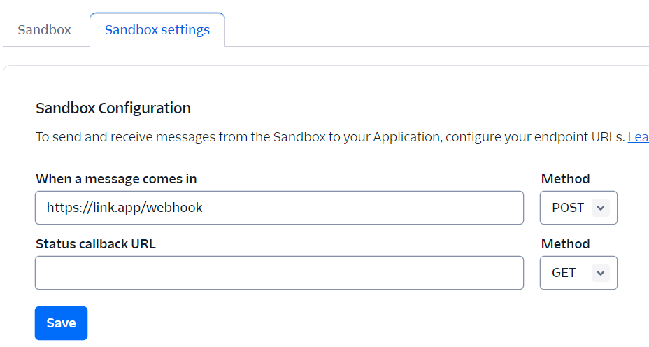
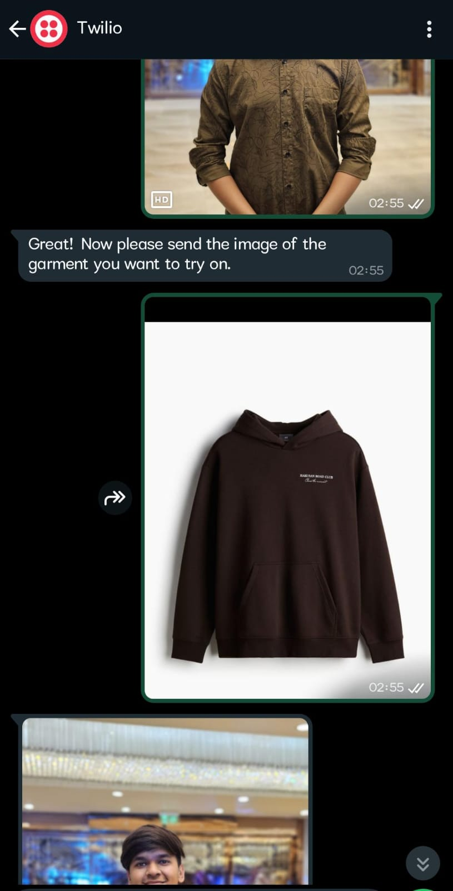
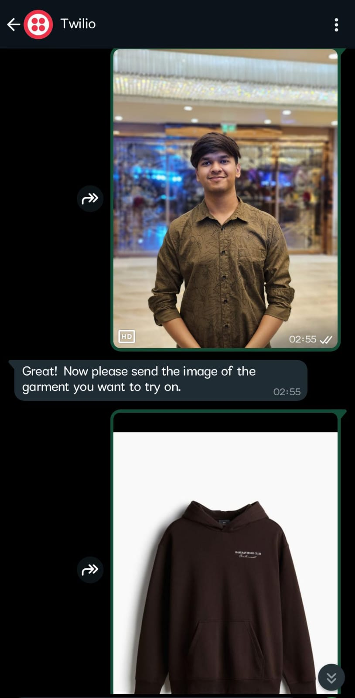
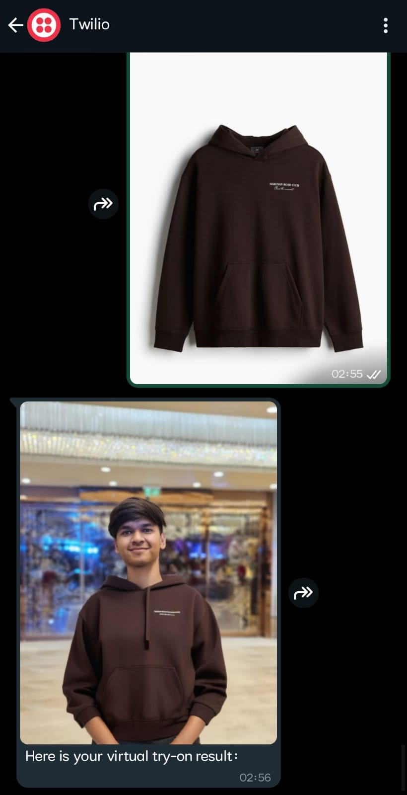

# Virtual Try-On with Flask, Twilio, and HuggingFace

This repository contains the code for a virtual try-on application built using Flask, Twilio , Gradio and Ngrok.

## Features
- Receive images of the user and a garment via WhatsApp.
- Use Gradio’s Inference API to generate virtual try-on results.
- Display's the final image to the user via WhatsApp.

## Prerequisites
Before running this project, ensure you have the following:
- Twilio account setup with whatsapp service enabled.
- Normal HF account to use the Gradio API.
- Compatible Python installed on your machine.

## Twilio Setup

1. Used the given link: (https://www.twilio.com/console/sms/whatsapp/sandbox):
2. Get your **Twilio Account SID** and **Auth Token** from your Twilio console:.
3. Upate the .env file with the credentials.

## NOTE: 

ThIs wasn't running on their ZeroGPU so I couldn't use that for my task https://huggingface.co/spaces/Kwai-Kolors/Kolors-Virtual-Try-On , So I used https://huggingface.co/spaces/Nymbo/Virtual-Try-On Space using Gradio.

## Setup
Clone the repository:
```bash
git https://github.com/Niharrrrrr/VirtualTryon.git
cd VirtualTryon
```
Install the required Python packages:
```
pip install -r requirements.txt
```
Set up your environment variables:
```
TWILIO_ACCOUNT_SID=your_account_sid
TWILIO_AUTH_TOKEN=your_auth_token
NGROK_URL=The URL you get after running that terminal
```

Start the Flask server:
```
python app.py
```
## Setup for Ngrok. 
Since the Flask server runs locally, we use **ngrok** to expose the server to the internet so that Twilio's WhatsApp Sandbox works.

1. Download ngrok with respect to your specs.
2. Once installed, authenticate ngrok by running:
```
ngrok authtoken your_ngrok_auth_token
```
3. Running ngrok to expose your local Flask server:
```
.\ngrok http 8080
```
You will see a link like:  https://link.app and set this as your Twilio webhook under the WhatsApp Sandbox Settings:

```
https://link.app/webhook
```
Also Updated the .env file with your ngrok URL.

## Usage
1. Forward your photo to the whatsapp chat.
2. It will ask you to send the photo of the garment
3. After that wait for a few seconds and it displays you your image.

## Results




   


